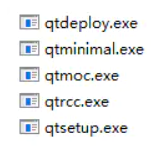

一个加解密的工具


### 使用步骤
1. 点击生成密钥,会生成公钥和私钥
2. 将公钥发给要与你通信的人
3. 保存别人(假设是张三和李四)的公钥到本机,选择刚刚保存的公钥，输入明文点击加密。
4. 将密文公布，只有张三和李四能够解密
### 原理
使用DES加密明文,使用RSA加密DES的密钥
## 我是开发者
本程序使用 golang + Qt 实现
### 所需工具:
#### 1. Qt 5.9.1
本程序使用 Qt5.9.1, 下载地址 [https://download.qt.io/archive/qt/](https://download.qt.io/archive/qt/)
#### 2. golang 1.16
#### 3. Go Qt 绑定库 
[therecipe/qt](https://github.com/therecipe/qt)
安装:
```shell
# 下载therecipe/qt库
go get -v -tags=no_env github.com/therecipe/qt/cmd/...
```
下载好库后会在`GOPATH%/bin`目录下出现几个帮助执行绑定工作的可执行文件



配置 Qt 编译环境，就是执行上面目录中的 qtsetup,但是不能直接执行，需要执行 `./setup.bat`
```bat
SET PATH=%PATH%;%GOPATH%\bin;

REM 配置QT目录和版本
SET QT_DIR=D:\Qt5.9.1
SET QT_VERSION_MAJOR=5.9.1

REM 编译32位程序
SET GOARCH=386

REM 语言绑定安装，只需执行一次
qtsetup.exe
```

#### 4. goqtuic

将 Qt Designer 生成的 ui 文件转成 go 程序 `go get -u -v github.com/stephenlyu/goqtuic`

### 编译方式:
目前只实现了 windows 下的编译:
1. 将 Qt Designer 生成的 ui 文件转成 go 程序: `goqtuic -ui-file .\windows.ui`
2. 修改 `./build.bat` 中Qt的目录与版本号 执行 `./build.bat`

### 运行方式
执行 deploy/windows/cipher.exe
